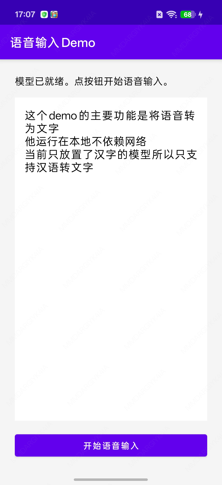

# Voice Input Demo

**English** | [中文](README.md)

This Demo is a sample for speech recognition and voice input. It follows the VadAsr example from the open-source project [sherpa-onnx](https://github.com/k2-fsa/sherpa-onnx). It runs on Android arm64-v8a phones.



**Keywords:** sherpa-onnx, VadAsr, VAD, ASR, Silero, Paraformer, speech-to-text, speech recognition, voice input, on-device, offline, Android, arm64-v8a, ONNX, JNI

> `model.int8.onnx` under `assets/sherpa-onnx-paraformer-zh-2023-09-14` is not in this repo. Download it from [ASR (Paraformer Chinese, type = 0)](#asr-paraformer-zh) and put it in `app/src/main/assets/sherpa-onnx-paraformer-zh-2023-09-14/`.

## 1. Features

- Tap **Start voice input**: request the microphone, start recording, and the button becomes **Stop**.
- While you speak, VAD splits audio on pauses; each segment is sent to non-streaming ASR.
- Tap **Stop**: end recording, flush the last unfinished segment, and print the recognized text on screen.

No network and no server. Recognition runs entirely on the phone.

## 2. How it works

It uses sherpa-onnx **VadAsr** (VAD + non-streaming ASR). Official sample:

<https://github.com/k2-fsa/sherpa-onnx/tree/master/android/SherpaOnnxVadAsr>

```text
Microphone PCM 16 kHz / 16-bit / mono
        │
        ▼
Silero VAD (silero_vad.onnx)
  Split speech on pauses
        │
        ▼
Non-streaming OfflineRecognizer (paraformer-zh)
  Decode each segment once
        │
        ▼
Tap Stop → vad.flush() → join text and show it on screen
```

| Component | Upstream config | Role |
|------|----------|------|
| VAD | `getVadModelConfig(type = 0)` Silero | Detect speech start/end; about 0.25s of pause ends a segment |
| ASR | `getOfflineModelConfig(type = 0)` Paraformer Chinese | Non-streaming recognition on each segment |

On **Stop**, `vad.flush()` sends the last segment that has not been cut by silence yet.

Upstream links:

- Repo: <https://github.com/k2-fsa/sherpa-onnx>
- Docs: <https://k2-fsa.github.io/sherpa/onnx/index.html>
- Android samples: <https://github.com/k2-fsa/sherpa-onnx/tree/master/android>
- Model releases: <https://github.com/k2-fsa/sherpa-onnx/releases>

## 3. Build from open source

There are only three artifacts. All come from the public sherpa-onnx repo / Releases. This project does not depend on other modules in this workspace.

### 3.1 Clone the source and copy the Kotlin bindings

The JNI wrappers for Vad / OfflineRecognizer live in the official VadAsr app. Copy them here:

```bash
git clone https://github.com/k2-fsa/sherpa-onnx.git
cd sherpa-onnx

cp android/SherpaOnnxVadAsr/app/src/main/java/com/k2fsa/sherpa/onnx/*.kt \
   <this-project>/app/src/main/java/com/k2fsa/sherpa/onnx/
```

The UI is `app/src/main/java/com/autoprocedure/voice/MainActivity.kt`. It only records, handles start/stop, and draws the recognized text.

### 3.2 Build the `.so` files (official script)

JNI needs two shared libraries under `app/src/main/jniLibs/arm64-v8a/`:

| File | Role |
|------|------|
| `libsherpa-onnx-jni.so` | Kotlin ↔ C++ JNI |
| `libonnxruntime.so` | ONNX Runtime inference |

Prerequisite: Android NDK installed (the official script commonly uses 27.x).

```bash
export ANDROID_NDK=$ANDROID_HOME/ndk/27.3.13750724   # change to your NDK path
export ANDROID_HOME=$ANDROID_HOME

cd sherpa-onnx
./build-android-arm64-v8a.sh
```

The script downloads ONNX Runtime from the public URL and cross-compiles with CMake + NDK. Output:

```text
build-android-arm64-v8a/install/lib/
├── libsherpa-onnx-jni.so
└── libonnxruntime.so
```

Copy them into this project:

```bash
mkdir -p app/src/main/jniLibs/arm64-v8a
cp sherpa-onnx/build-android-arm64-v8a/install/lib/libsherpa-onnx-jni.so \
   sherpa-onnx/build-android-arm64-v8a/install/lib/libonnxruntime.so \
   app/src/main/jniLibs/arm64-v8a/
```

Kotlin loads them via `System.loadLibrary("sherpa-onnx-jni")` in `Vad.kt` / `OfflineRecognizer.kt`. This build is `arm64-v8a` only; use an arm64 device. For an x86_64 emulator, run the official `build-android-x86-64.sh` instead.

### 3.3 Download models (official Releases)

Put models in `app/src/main/assets/`. The app reads them through `AssetManager`. Releases:

<https://github.com/k2-fsa/sherpa-onnx/releases>

**VAD (Silero)**

```bash
mkdir -p app/src/main/assets
cd app/src/main/assets
curl -L -O https://github.com/k2-fsa/sherpa-onnx/releases/download/asr-models/silero_vad.onnx
```

This matches `model = "silero_vad.onnx"` in `getVadModelConfig(0)`.

<a id="asr-paraformer-zh" href="#asr-paraformer-zh">ASR (Paraformer Chinese, type = 0)</a>

`model.int8.onnx` is about 232MB and exceeds GitHub's 100MB limit, so it is not in the repo. Download it locally:

```bash
cd app/src/main/assets
curl -L -O https://github.com/k2-fsa/sherpa-onnx/releases/download/asr-models/sherpa-onnx-paraformer-zh-2023-09-14.tar.bz2
tar xjf sherpa-onnx-paraformer-zh-2023-09-14.tar.bz2
rm sherpa-onnx-paraformer-zh-2023-09-14.tar.bz2
# Keep only onnx / txt; drop README, test wavs, and empty dirs
find sherpa-onnx-paraformer-zh-2023-09-14 -type f ! \( -name '*.onnx' -o -name '*.txt' \) -delete
find sherpa-onnx-paraformer-zh-2023-09-14 -type d -empty -delete
```

Final layout:

```text
app/src/main/assets/
├── silero_vad.onnx
└── sherpa-onnx-paraformer-zh-2023-09-14/
    ├── model.int8.onnx
    └── tokens.txt
```

Directory and file names must match `getOfflineModelConfig(0)` in `OfflineRecognizer.kt`.

## 4. Run

Open this directory in Android Studio and Run on an arm64 device. Tap start, speak, tap stop; the recognized text appears on screen.
